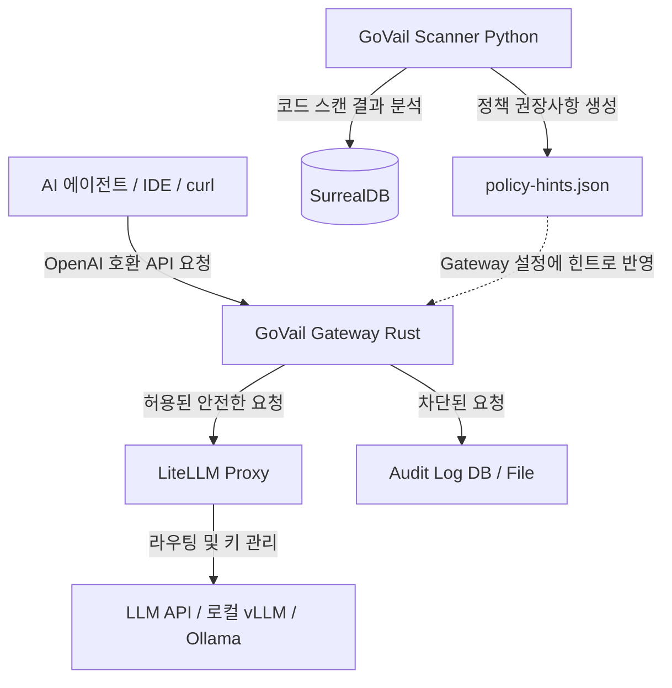
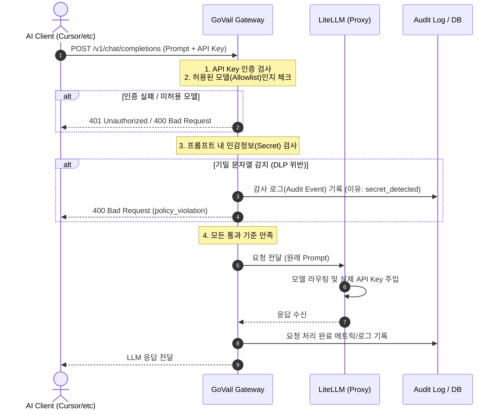

# GoVail 아키텍처 및 데이터 흐름 (Architecture)

GoVail은 복잡한 마이크로서비스 설계나 복잡도가 높은 인프라를 지향하지 않습니다. 핵심 철학은 **"요청의 통로에 가벼운 필터를 끼워 넣어 안전지대를 만든다"**는 것입니다.

이를 위해 전체 아키텍처를 크게 3가지 계층으로 나누었습니다.

---

## 1. 상위 수준 아키텍처 (High-Level Architecture)

전체 컴포넌트 간 관계는 다음과 같습니다.

* **Client**: Cursor, Claude Code, 혹은 일반 애플리케이션의 OpenAI SDK 연동 클라이언트입니다. OpenAI 주소 대신 GoVail Gateway 주소(`http://localhost:8080/v1`)를 가리키도록 설정하면 작동합니다.
* **GoVail Gateway**: 요청을 가장 먼저 받아 인증 검사, 모델 권한 검사, 프롬프트 기밀 패턴 검사(DLP)를 빠르게 처리합니다. 
* **LiteLLM Proxy**: 게이트웨이를 통과한 요청에 대해 실제 LLM 공급자(OpenAI, Anthropic 등)의 엔드포인트와 API 키를 매핑하고 라우팅합니다.
* **GoVail Scanner**: AI 코딩 도구를 허용하기 전에, 로컬 레거시 코드에 어떤 위험요소(비밀번호 하드코딩 등)가 있는지 분석하여 게이트웨이가 차단할 룰 힌트를 생성해 줍니다.

---

## 2. 요청 처리 라이프사이클 (Request Lifecycle)

하나의 프롬프트가 Gateway를 통과하는 상세 과정은 다음과 같습니다.

---

## 3. 왜 Gateway-First인가?

우리가 게이트웨이를 가장 앞단에 세운 이유는 단순합니다. 

* **클라이언트 코드 수정 최소화**: Cursor나 애플리케이션 코드를 고치지 않고, 단지 `base_url` 설정만 게이트웨이 주소로 변경하여 즉시 정책을 적용할 수 있습니다.
* **실시간 통제**: 백그라운드 분석기(Scanner)나 비동기 작업(Runtime)은 시간이 걸립니다. 하지만 API 호출 시점의 차단은 사용자 체감 지연을 최소화하는 수준으로 극단적으로 억제되어야 서비스 사용성을 해치지 않습니다. Rust 기반의 Axum을 게이트웨이 언어로 선택한 이유도 고성능 실시간 처리를 지향하기 때문입니다.

GoVail 아키텍처는 이처럼 **"가벼운 입구 제어(Gateway)"**에 초점을 맞추어 설계되었습니다.
