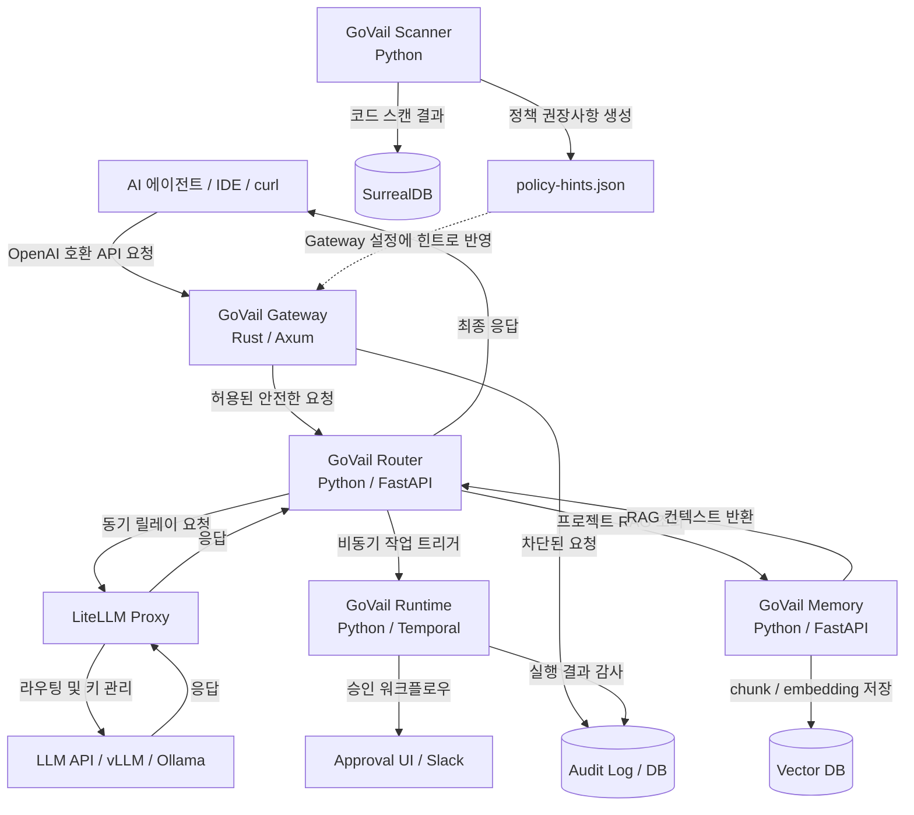
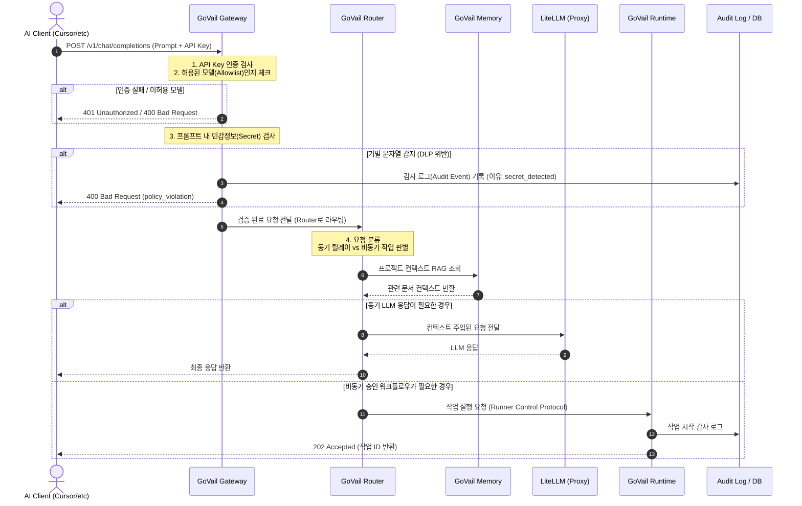

# GoVail 아키텍처 및 데이터 흐름 (Architecture)

GoVail은 복잡한 마이크로서비스 설계나 복잡도가 높은 인프라를 지향하지 않습니다. 핵심 철학은 **"요청의 통로에 가벼운 필터를 끼워 넣어 안전지대를 만든다"**는 것입니다.

초기 설계 이후 GoVail 프로젝트는 성장했습니다. 단순한 Gateway + Scanner의 2-컴포넌트 구조에서, 스마트 라우팅(Router), 프로젝트별 맥락 검색(Memory), 비동기 실행 파이프라인(Runtime)을 갖춘 **5-컴포넌트 아키텍처**로 진화했습니다.

---

## 1. 전체 컴포넌트 맵 (Full Component Map)

현재 GoVail을 구성하는 모든 컴포넌트와 그 관계입니다.

---

## 2. 요청 처리 라이프사이클 (Request Lifecycle)

하나의 프롬프트가 GoVail 전체 스택을 통과하는 상세 과정입니다.

---

## 3. 컴포넌트별 책임 요약

### GoVail Gateway (Rust / Axum)

요청의 **최전선 필터**입니다. 10ms 이내 처리를 목표로 하며, 상태를 갖지 않는(Stateless) 단순한 구조를 고집합니다.

- API Key 인증 및 모델 Allowlist 검사
- 프롬프트 DLP(기밀 문자열) 패턴 스캔
- 차단 시 감사 로그 기록 후 즉시 거절

### GoVail Router (Python / FastAPI)

**스마트 분기점**입니다. Gateway를 통과한 요청을 받아, 요청의 성격에 따라 동기/비동기 경로로 나눕니다.

- 동기 LLM 호출 → LiteLLM으로 릴레이
- 비동기 장기 작업 → Runtime으로 트리거
- SSE(Server-Sent Events) Keep-alive 하트비트로 GCP 타임아웃 방지
- Memory에서 프로젝트 RAG 컨텍스트를 조회해 요청에 주입

### GoVail Memory (Python / FastAPI)

**프로젝트별 RAG 컴포넌트**입니다. 외부 클라이언트의 직접 진입점이 아니며, Router를 통해서만 호출됩니다.

- 프로젝트별 문서 네임스페이스 격리 관리
- 문서 ingest, chunk 분할, embedding 저장
- 프로젝트 스코프 기반 RAG 검색 및 source 반환

### GoVail Runtime (Python / Temporal)

**비동기 실행 파이프라인**입니다. 사람의 승인이 필요하거나 시간이 오래 걸리는 작업을 처리합니다.

- Runner Control Protocol 기반 작업 수신
- NovelPipeline 비동기 파이프라인으로 단계별 실행
- Runner SDK CLI를 통한 작업 제어
- 모든 실행 결과를 감사 로그로 기록

### GoVail Scanner (Python)

**정적 분석 힌트 생성기**입니다. AI 코딩 도구를 허용하기 전에, 레거시 코드의 위험 요소를 사전에 파악합니다.

- 레거시 PHP 등 레거시 소스코드 스캔
- 위험 패턴 식별 및 SurrealDB에 결과 저장
- Gateway가 참조할 `policy-hints.json` 생성

---

## 4. 왜 이 구조인가?

### Gateway-First

클라이언트 코드를 수정하지 않고 `base_url` 설정 하나만 바꾸면 즉시 정책이 적용됩니다. Rust/Axum은 고성능 실시간 처리를 위한 선택입니다.

### Router를 Gateway와 분리한 이유

Router는 Memory 조회, Runtime 트리거, SSE 스트리밍 유지 등 상태와 지연이 수반되는 로직을 담당합니다. 이러한 복잡성을 Gateway에 넣으면 Gateway의 핵심 속성인 단순함과 빠른 응답성이 무너집니다.

### Memory를 별도 서비스로 분리한 이유

프로젝트별 RAG 스코프 격리, embedding 저장소 교체 유연성, 독립적인 스케일링이 필요했습니다. 또한 외부에 직접 노출되지 않고 Router 뒤에 위치함으로써 프로젝트 컨텍스트 유출을 방지합니다.
