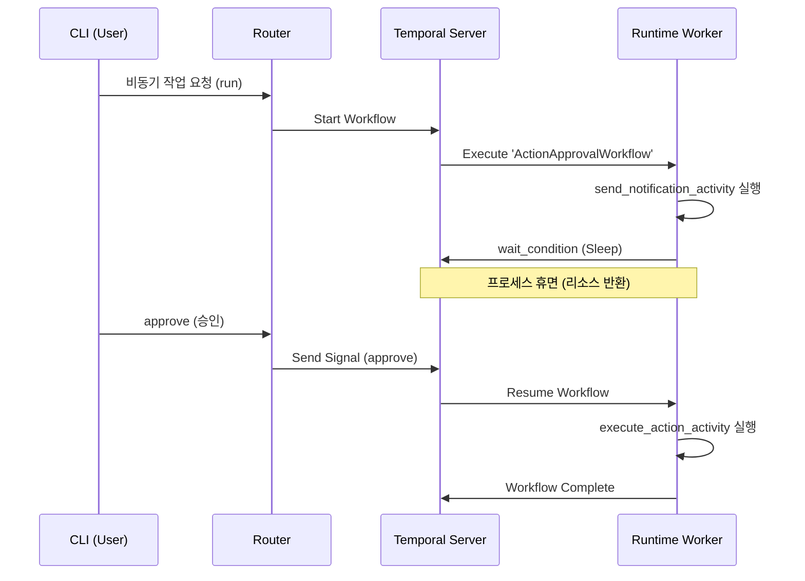

# Temporal로 구현한 Human-in-the-loop 비동기 파이프라인

GoVail Runtime 서비스는 AI가 코드를 분석하거나 변경 제안을 할 때, 즉각적으로 시스템에 반영하는 대신 **"사람의 개입(Human-in-the-loop)"**을 거치도록 설계되었습니다. 이 과정은 수 분에서 수 시간이 걸릴 수 있는 비동기 작업입니다.

이러한 장기 실행 파이프라인을 구축하기 위해 저는 파이썬 진영의 표준 격인 Celery나 단순 Redis 큐 대신 **Temporal**을 선택했습니다. 이번 포스트에서는 그 이유와 실제 구현 패턴을 소개합니다.

## 왜 Celery/Redis가 아니라 Temporal인가?

비동기 작업을 위해 백그라운드 워커를 도입할 때 가장 먼저 고려한 것은 Celery였습니다. 하지만 AI 거버넌스 파이프라인은 다음과 같은 특수한 요구사항이 있었습니다.

1. **상태 보존(Statefulness)과 내구성(Durability):**
   작업 도중 서버가 재시작되어도 워크플로우는 죽지 않고 중단된 지점부터 이어서 실행되어야 합니다.
2. **무한 대기(Human-in-the-loop):**
   개발자가 슬랙이나 UI를 통해 승인 버튼을 누를 때까지 파이프라인은 며칠이고 멈춰서 기다려야 합니다.
3. **가시성(Observability):**
   현재 파이프라인이 5단계 중 몇 번째 단계를 수행 중인지, 실패했다면 어떤 변수가 문제인지 시각적으로 파악해야 합니다.

Temporal은 코드로 워크플로우를 정의하면서도 이 모든 상태를 데이터베이스에 영속화(event sourcing)합니다. 슬립(`asyncio.sleep()`)을 호출하거나 특정 시그널(Signal)을 대기하는 동안 런타임 리소스를 점유하지 않는다는 점이 결정적인 채택 이유였습니다.

## 8개 워크플로우 설계

현재 Runtime 서비스 내부에는 목적에 따라 세분화된 8개의 워크플로우가 정의되어 있습니다:
- `code_scan`, `code_review`, `pr_create`, `jira_crud`, `jira_github_review`, `plan_create`, `novel` 등

이 중 AI가 변경 사항을 제안하고 사용자의 승인을 기다리는 로직을 어떻게 구현했는지 살펴보겠습니다.

## Activity 및 Signal 패턴으로 승인 대기하기

사용자 승인은 워크플로우 밖에서 들어오는 비동기적 이벤트입니다. Temporal에서는 이를 **Signal**로 처리합니다. 

아래는 간략화된 `Action Approval Workflow`의 파이썬 코드 예시입니다.

```python
from temporalio import workflow

@workflow.defn
class ActionApprovalWorkflow:
    def __init__(self):
        self._approved = False
        self._rejected = False

    @workflow.signal
    def approve(self) -> None:
        self._approved = True

    @workflow.signal
    def reject(self) -> None:
        self._rejected = True

    @workflow.run
    async def run(self, payload: dict) -> str:
        # 1. 사용자에게 승인 요청 알림 전송 (Activity 호출)
        await workflow.execute_activity(
            "send_notification_activity",
            payload,
            schedule_to_close_timeout=timedelta(seconds=10)
        )

        # 2. 외부 Signal(승인/거절)이 들어올 때까지 무한 대기
        await workflow.wait_condition(
            lambda: self._approved or self._rejected
        )

        if self._approved:
            # 3-1. 승인 시 실제 작업 수행
            return await workflow.execute_activity(
                "execute_action_activity",
                payload,
                schedule_to_close_timeout=timedelta(minutes=5)
            )
        else:
            # 3-2. 거절 시 중단
            return "Action rejected by user"
```

위 코드에서 `workflow.wait_condition`을 만나는 순간 Temporal 서버는 워크플로우의 상태를 DB에 저장하고 워커 스레드를 반환합니다. 며칠 뒤 사용자가 CLI나 대시보드에서 `approve` 시그널을 쏘면, 워크플로우는 깨어나 다음 로직을 이어나갑니다.

## 워크플로우 시각화 (Mermaid)

이 과정을 시퀀스 다이어그램으로 그려보면 다음과 같습니다.



## Runner Control Protocol 연동

이러한 Temporal 워크플로우는 시스템 내부 구현일 뿐입니다. 외부의 CLI(Cursor, Claude Code 등)나 UI가 이 워크플로우와 소통할 수 있도록, 저는 **Runner Control Protocol**이라는 JSON 규격을 정의했습니다.

사용자는 복잡한 Temporal SDK를 알 필요 없이, Gateway/Router를 향해 표준화된 JSON 페이로드(예: `action: approve`, `workflow_id: 123`)만 전송하면 됩니다. 

결과적으로 Temporal은 "코드로서의 신뢰성 높은 상태 기계(State Machine)"를 완벽하게 제공해주었으며, Human-in-the-loop라는 까다로운 요구사항을 가장 우아하게 풀 수 있는 열쇠가 되었습니다.
